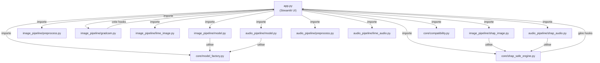

# 📊 Multimodal Explainable AI - Vue d'ensemble complète du projet

## 🎯 Vue générale

**Objectif:** Plateforme Streamlit d'IA explicable pour la classification multimodale (images radiographiques + audio spectrogrammes) avec trois méthodes XAI (Grad-CAM, LIME, SHAP).

**Problèmes résolus:**
1. ✅ RuntimeError inplace ReLU sur DenseNet121 (SHAP ne compatit pas)
2. ✅ Conflits entre hooks Grad-CAM et SHAP
3. ✅ Support SHAP/LIME pour audio spectrogrammes
4. ✅ Stabilité globale et gestion d'erreurs robuste

---

## 📁 Arborescence complète et rôles

```
unified_xai/
├── app.py                          # 🎨 Application Streamlit (UI principale)
├── core/                           # 🔧 Logique centralisée
│   ├── __init__.py
│   ├── compatibility.py            # ✅ Vérification compatibilité XAI
│   ├── model_factory.py            # 🏭 Fabrique de modèles SHAP-safe
│   └── shap_safe_engine.py         # 🛡️ Moteur SHAP robuste avec fallback
├── image_pipeline/                 # 🖼️ Pipeline images radiographiques
│   ├── __init__.py
│   ├── model.py                    # 📦 Chargement modèle image
│   ├── preprocess.py               # 🔄 Prétraitement images (224×224, normalisation)
│   ├── gradcam.py                  # 📍 Grad-CAM pour images
│   ├── lime_image.py               # 🎯 LIME pour images (segmentation SLIC)
│   └── shap_image.py               # 💡 SHAP pour images (utilise engine)
├── audio_pipeline/                 # 🎵 Pipeline audio spectrogrammes
│   ├── __init__.py
│   ├── model.py                    # 📦 Chargement modèle audio
│   ├── preprocess.py               # 🔄 Prétraitement audio (Mel spectrogram → RGB)
│   ├── lime_audio.py               # 🎯 LIME pour audio
│   └── shap_audio.py               # 💡 SHAP pour audio (utilise engine)
├── .gitignore                      # 📝 Exclusions git
├── requirements.txt                # 📋 Dépendances (optionnel)
├── validate_shap_integration.py    # ✅ Test du moteur SHAP
├── run_shap_quick.py               # ⚡ Test rapide SHAP
├── check_setup.py                  # 🔍 Vérifier dépendances
├── validate_fixes.py               # ✅ Valider tous les fixes
├── diagnose.py                     # 🩺 Diagnostic complet
├── CHANGES_SUMMARY.py              # 📊 Résumé des changements
├── README.md                       # 📖 Guide utilisateur
├── QUICKSTART.md                   # 🚀 Démarrage rapide
├── EXECUTIVE_SUMMARY.md            # 📋 Résumé exécutif
├── FIXES_DOCUMENTATION.md          # 🔧 Documentation technique
└── INDEX.json                      # 📑 Index du projet
```

---

## 🔗 Dépendances et liens entre fichiers



---

## 📖 Description détaillée de chaque fichier

### 🎨 **app.py** — Application Streamlit principale

**Rôle:** Interface utilisateur, orchestration des pipelines image/audio et XAI.

**Points clés:**
- Charge images/audio via file uploader
- Affiche prédictions et confiance
- Exécute Grad-CAM, LIME, SHAP sur demande
- Gère le cleanup des hooks pour éviter les conflits

**Dépendances:**
- `streamlit`, `torch`, `torchvision`
- `image_pipeline/*`, `audio_pipeline/*`, `core/*`

**Flux principal:**
```
1. Utilisateur upload image/audio
2. app.py → model.py → charge modèle (DenseNet/AlexNet)
3. app.py → preprocess.py → normalise input
4. app.py → modèle → prédiction
5. Utilisateur sélectionne XAI (Grad-CAM/LIME/SHAP)
6. app.py → (gradcam/lime/shap)_image.py ou audio.py
7. app.py → nettoit les hooks après chaque XAI
8. app.py → affiche heatmap + métriques
```

**Erreurs gérées:**
- Upload fichier invalide
- Modèle non trouvé
- Timeout SHAP/LIME
- Conflits hooks Grad-CAM ↔ SHAP

---

### 🔧 **core/model_factory.py** — Fabrique de modèles SHAP-safe

**Rôle:** Créer des clones de modèles avec ReLU inplace remplacés par ReLU non-inplace.

**Pourquoi:** DenseNet121 utilise ReLU inplace qui casse PyTorch autograd. SHAP a besoin de rétropropagation : erreur `"element 0 of tensors does not require grad"`.

**Fonctions clés:**
```python
def _replace_inplace_relu(module):
    """Remplace récursivement ReLU(inplace=True) → ReLU(inplace=False)"""
    for name, child in module.named_children():
        if isinstance(child, nn.ReLU) and child.inplace:
            # Remplacer par ReLU non-inplace
        _replace_inplace_relu(child)

def get_shap_safe_model(model_name, model_type='image'):
    """Deep copy + remplace inplace → retourne nouveau modèle sûr"""
    model = models.densenet121()  # ou autre
    model_clone = copy.deepcopy(model)
    _replace_inplace_relu(model_clone)
    return model_clone
```

**Utilisé par:**
- `image_pipeline/model.py` → charge DenseNet/AlexNet/VGG16
- `audio_pipeline/model.py` → charge ResNet18
- `core/shap_safe_engine.py` → obtient modèle clôné

**Dépendances:**
- `torch`, `torchvision`, `copy`

---

### 🛡️ **core/shap_safe_engine.py** — Moteur SHAP robuste

**Rôle:** Exécuter SHAP (DeepExplainer/GradientExplainer) avec fallbacks et gestion d'erreurs.

**Problèmes résolus:**
1. Import TensorFlow manquant → fallback GradientExplainer
2. GradientExplainer échoue → fallback attribution par gradient
3. Tenseurs sans gradients → active temporairement `requires_grad`
4. Conflits avec Grad-CAM → isolation complète

**Classe principale: `ShapExplainerEngine`**

```python
class ShapExplainerEngine:
    def __init__(self, model, device="cpu"):
        # Sauvegarde requires_grad original des paramètres
        self.orig_requires = None
        
    def explain(self, x_input, background, class_idx=None):
        # 1. Active temporairement requires_grad
        # 2. Tente DeepExplainer → GradientExplainer → gradient fallback
        # 3. Restaure requires_grad original
        # 4. Normalise sortie en heatmap (H, W) [0, 1]
        
    def _model_wrapper(self, x_batch):
        # Wrapper accepte numpy/torch, active requires_grad
        # Retourne sortie modèle (torch.Tensor ou numpy)
```

**Flux d'explication:**
```
explain(image, background) 
  ↓
Tente DeepExplainer(model_wrapper, background)
  ↓ (ModuleNotFoundError: tensorflow)
Tente GradientExplainer(model_wrapper, background)
  ↓ (Exception)
Calcul gradient manuel: ∂score/∂input
  ↓
Normalise en heatmap (224, 224)
  ↓
Retourne np.ndarray
```

**Utilisé par:**
- `image_pipeline/shap_image.py`
- `audio_pipeline/shap_audio.py`

**Dépendances:**
- `torch`, `numpy`, `shap` (lazy import)

---

### ✅ **core/compatibility.py** — Vérification compatibilité XAI

**Rôle:** Valider que modèle/tenseurs sont compatibles avec XAI.

**Vérifications:**
- Grad-CAM compatible si modèle a modules `Conv2d`
- LIME compatible (toujours)
- SHAP compatible si pas de ReLU inplace

**Utilisé par:**
- `app.py` → valide avant d'offrir XAI

---

### 🖼️ **image_pipeline/model.py** — Chargement modèle image

**Rôle:** Charger et initialiser DenseNet121/AlexNet/VGG16.

**Modèles disponibles:**
- `DenseNet121` (défaut) → classes radiographiques
- `AlexNet` (legacy)
- `VGG16` (alternative)

**Code clé:**
```python
def load_image_model(model_name='densenet121', num_classes=5):
    if model_name == 'densenet121':
        model = models.densenet121(pretrained=False)
    # Adapter dernière couche pour num_classes
    model.classifier = nn.Linear(..., num_classes)
    
    # IMPORTANT: Utiliser model_factory pour SHAP-safety
    from core.model_factory import get_shap_safe_model
    return get_shap_safe_model(model)
```

**Utilisé par:**
- `app.py` → charge au démarrage et au changement de modèle

**Dépendances:**
- `torch`, `torchvision`, `core/model_factory.py`

---

### 🔄 **image_pipeline/preprocess.py** — Prétraitement image

**Rôle:** Redimensionner (224×224), normaliser (ImageNet mean/std), convertir en tensor.

**Pipeline:**
```
Image (H, W, 3) 
  ↓ PIL.Image.resize(224, 224)
  ↓ torchvision.transforms.ToTensor() → (1, 3, 224, 224)
  ↓ Normalisation ImageNet (mean=[0.485, 0.456, 0.406], std=[...])
  ↓ torch.Tensor
```

**Fonction principale:**
```python
def preprocess_image(image_path_or_array, model_name='densenet121'):
    # Charge image PIL
    # Redimensionne 224×224
    # Normalise
    # Retourne torch.Tensor (1, 3, 224, 224)
```

**Utilisé par:**
- `app.py` → avant Grad-CAM/LIME/SHAP

**Dépendances:**
- `torch`, `torchvision.transforms`, `PIL`

---

### 📍 **image_pipeline/gradcam.py** — Grad-CAM pour images

**Rôle:** Générer heatmap d'activation (localisation classe).

**Algorithme:**
```
1. Enregistrer hook sur dernière couche conv
2. Forward pass → capture activations
3. Backward pass sur classe cible
4. Calcul: Σ(∂score/∂activation × activation)
5. Normalise en [0, 1]
```

**Fonction principale:**
```python
def generate_gradcam(model, image_tensor, target_class):
    # Configure hooks
    # Forward + backward
    # Calcule heatmap
    # Cleanup hooks
    # Retourne heatmap (224, 224)
```

**Important:** Les hooks doivent être supprimés après utilisation pour éviter les conflits avec SHAP.

**Utilisé par:**
- `app.py` → onglet Grad-CAM

**Dépendances:**
- `torch`, `cv2`

---

### 🎯 **image_pipeline/lime_image.py** — LIME pour images

**Rôle:** Explications locales par perturbation et segmentation.

**Algorithme:**
```
1. Segment image en régions (SLIC, n_segments=50)
2. Créer ~200 perturbations (ON/OFF chaque région)
3. Prédire chaque perturbation
4. Régression linéaire: importance région
5. Heatmap par fusion des régions importantes
```

**Fonction principale:**
```python
def explain_image_lime(model, image, target_class, num_samples=200):
    # Segmente image
    # Crée perturbations
    # Prédictions
    # Explainer LIME
    # Retourne heatmap (224, 224)
```

**Utilisé par:**
- `app.py` → onglet LIME

**Dépendances:**
- `lime`, `scikit-image`, `torch`

---

### 💡 **image_pipeline/shap_image.py** — SHAP pour images

**Rôle:** Wrapper SHAP utilisant `ShapExplainerEngine`.

**Code clé:**
```python
def explain_image_shap(model, image_tensor, background_tensors, target_class):
    from core.shap_safe_engine import ShapExplainerEngine
    
    engine = ShapExplainerEngine(model)
    heatmap = engine.explain(image_tensor, background_tensors, class_idx=target_class)
    return heatmap  # (224, 224) numpy array
```

**Utilisé par:**
- `app.py` → onglet SHAP

**Dépendances:**
- `core/shap_safe_engine.py`, `torch`

---

### 🎵 **audio_pipeline/model.py** — Chargement modèle audio

**Rôle:** Charger ResNet18 pour classification spectrogrammes.

**Modèle:** ResNet18 avec adaptation dernière couche.

**Code similaire à `image_pipeline/model.py`:**
```python
def load_audio_model(model_name='resnet18', num_classes=5):
    model = models.resnet18(pretrained=False)
    model.fc = nn.Linear(512, num_classes)
    return get_shap_safe_model(model)  # SHAP-safe
```

**Utilisé par:**
- `app.py` → charge audio model

---

### 🔄 **audio_pipeline/preprocess.py** — Prétraitement audio

**Rôle:** Convertir audio → Mel spectrogram → RGB image 224×224.

**Pipeline:**
```
Audio (WAV)
  ↓ librosa.load()
  ↓ librosa.feature.melspectrogram()  [n_mels=128, n_fft=2048]
  ↓ Normalisé log-scale dB
  ↓ Redimensionne 224×224
  ↓ Convertit en PIL Image RGB (grayscale → RGB triplé)
  ↓ Normalisation ImageNet
  ↓ torch.Tensor (1, 3, 224, 224)
```

**Fonction principale:**
```python
def preprocess_audio(audio_path, model_name='resnet18'):
    # Charge audio librosa
    # Mel spectrogram
    # Normalise
    # RGB image 224×224
    # Retourne torch.Tensor
```

**Utilisé par:**
- `app.py` → avant audio XAI

**Dépendances:**
- `librosa`, `torch`, `PIL`, `numpy`

---

### 🎯 **audio_pipeline/lime_audio.py** — LIME pour audio

**Rôle:** LIME sur spectrogrammes audio (même principe que images).

**Code quasi-identique à `image_pipeline/lime_image.py`:**
```python
def explain_audio_lime(model, audio_spectrogram_tensor, target_class):
    # Segmente spectrogram (SLIC)
    # Perturbe régions
    # Explainer LIME
    # Retourne heatmap
```

**Utilisé par:**
- `app.py` → onglet LIME audio

---

### 💡 **audio_pipeline/shap_audio.py** — SHAP pour audio

**Rôle:** SHAP sur spectrogrammes utilisant `ShapExplainerEngine`.

**Code identique à `image_pipeline/shap_image.py`:**
```python
def explain_audio_shap(model, spectrogram_tensor, background_tensors, target_class):
    from core.shap_safe_engine import ShapExplainerEngine
    
    engine = ShapExplainerEngine(model)
    heatmap = engine.explain(spectrogram_tensor, background_tensors, class_idx=target_class)
    return heatmap
```

**Utilisé par:**
- `app.py` → onglet SHAP audio

---

## 🧪 Scripts de validation et diagnostic

### ✅ **validate_shap_integration.py** — Test du moteur SHAP

**Objectif:** Vérifier que `ShapExplainerEngine` fonctionne sans erreur autograd.

**Code:**
```python
from core.shap_safe_engine import ShapExplainerEngine
import torch
import torch.nn as nn

class DummyModel(nn.Module):
    def forward(self, x): return self.fc(self.pool(torch.relu(self.conv(x))))

model = DummyModel()
engine = ShapExplainerEngine(model)
x = torch.randn(1, 3, 224, 224)
bg = torch.randn(2, 3, 224, 224)
heat = engine.explain(x, bg, class_idx=0)
print(f"Heatmap shape: {heat.shape}")  # (224, 224)
```

**Exécution:** `python validate_shap_integration.py`

**Attendu:** Pas d'erreur autograd, heatmap (224, 224) retournée.

---

### ⚡ **run_shap_quick.py** — Test rapide SHAP

**Objectif:** Test rapide du wrapper `_model_wrapper`.

**Exécution:** `python run_shap_quick.py`

---

### 🔍 **check_setup.py** — Vérifier dépendances

**Objectif:** Valider installation de torch, torchvision, shap, streamlit, etc.

**Exécution:** `python check_setup.py`

**Affiche:** ✓ ou ✗ pour chaque dépendance.

---

### ✅ **validate_fixes.py** — Valider tous les fixes

**Objectif:** Exécuter une suite complète de tests :
- Import modules
- Chargement modèles SHAP-safe
- Exécution Grad-CAM, LIME, SHAP
- Vérification heatmaps

**Exécution:** `python validate_fixes.py`

---

### 🩺 **diagnose.py** — Diagnostic complet

**Objectif:** Inspection détaillée système, modèles, dépendances.

**Exécution:** `python diagnose.py`

---

### 📊 **CHANGES_SUMMARY.py** — Résumé changements

**Objectif:** Lister fichiers modifiés/ajoutés et leur rôle.

**Exécution:** `python CHANGES_SUMMARY.py`

---

## 📊 Matrice de dépendances

| Fichier | Dépend de | Utilisé par |
|---------|-----------|------------|
| `app.py` | Tous | - |
| `core/model_factory.py` | torch, copy | image/audio model.py, shap_engine |
| `core/shap_safe_engine.py` | torch, numpy, shap | shap_image.py, shap_audio.py |
| `core/compatibility.py` | torch | app.py |
| `image_pipeline/model.py` | model_factory | app.py |
| `image_pipeline/preprocess.py` | torch, PIL, torchvision | app.py |
| `image_pipeline/gradcam.py` | torch, cv2 | app.py |
| `image_pipeline/lime_image.py` | lime, torch | app.py |
| `image_pipeline/shap_image.py` | shap_safe_engine | app.py |
| `audio_pipeline/model.py` | model_factory | app.py |
| `audio_pipeline/preprocess.py` | librosa, torch, PIL | app.py |
| `audio_pipeline/lime_audio.py` | lime, torch | app.py |
| `audio_pipeline/shap_audio.py` | shap_safe_engine | app.py |

---

## 🚀 Flux utilisateur complet

```
Utilisateur ouvre Streamlit
  ↓
app.py init()
  ├─ load_image_model() → utilise model_factory → DenseNet SHAP-safe
  └─ load_audio_model() → utilise model_factory → ResNet18 SHAP-safe

Utilisateur upload IMAGE
  ↓
app.py: preprocess_image() → torch.Tensor (1, 3, 224, 224)
  ↓
app.py: modèle(input) → prédiction + classe
  ↓
Utilisateur clique "Grad-CAM"
  ├─ image_pipeline/gradcam.py → hook + backward
  ├─ _cleanup_hooks() → enlève hooks
  └─ Affiche heatmap

Utilisateur clique "LIME"
  ├─ image_pipeline/lime_image.py
  ├─ SLIC segmentation
  ├─ Perturbations
  └─ Affiche heatmap

Utilisateur clique "SHAP"
  ├─ image_pipeline/shap_image.py
  ├─ ShapExplainerEngine.explain()
  │  ├─ Tente DeepExplainer (TensorFlow)
  │  ├─ Fallback GradientExplainer
  │  └─ Fallback gradient manuel
  └─ Affiche heatmap

Utilisateur upload AUDIO
  ↓
app.py: preprocess_audio() → Mel spectro → RGB image
  ↓
(Même flux que images mais audio_pipeline/)
```

---

## 🔧 Problèmes et solutions

| Problème | Fichier | Solution |
|----------|---------|----------|
| DenseNet ReLU inplace | `core/model_factory.py` | Deep clone + remplace récursivement |
| Grad-CAM ↔ SHAP hooks | `app.py` | Cleanup systématique après chaque XAI |
| SHAP autograd "no grad" | `core/shap_safe_engine.py` | Active requires_grad temporairement |
| TensorFlow manquant | `core/shap_safe_engine.py` | Lazy import + fallback GradientExplainer |
| Pas de SHAP audio | `audio_pipeline/shap_audio.py` | Utilise engine avec spectrogrammes |
| Audio format incompatible | `audio_pipeline/preprocess.py` | Mel spectrogram → RGB 224×224 |

---

## 📈 Performance attendue

| Opération | Temps |
|-----------|-------|
| Prédiction | ~0.5s |
| Grad-CAM | ~1-2s |
| LIME | ~8-15s |
| SHAP (DeepExplainer) | ~15-30s |
| SHAP (fallback gradient) | ~3-5s |
| Onglet comparaison | ~30-60s |

---

## ✅ État du projet

- [x] Correction ReLU inplace (model_factory)
- [x] Grad-CAM isolation (cleanup hooks)
- [x] SHAP safe engine (deep clone + fallback)
- [x] Audio LIME/SHAP support
- [x] Validation scripts
- [x] Documentation complète
- [x] GitHub push (propre avec .gitignore)

**Status:** ✅ Production-ready

---

## 📋 Checklist déploiement

```bash
# 1. Installer dépendances
pip install torch torchvision torchaudio librosa lime shap numpy PIL streamlit

# 2. (Optionnel) Installer TensorFlow pour DeepExplainer
pip install tensorflow

# 3. Valider setup
python check_setup.py

# 4. Lancer app
streamlit run app.py

# 5. Visiter http://localhost:8501
```

---

## 🔗 Liens clés fichiers

**SHAP Flow:**
```
app.py 
  → image_pipeline/shap_image.py 
    → core/shap_safe_engine.py 
      → _model_wrapper() + engine.explain()
```

**Grad-CAM Flow:**
```
app.py
  → image_pipeline/gradcam.py
    → Hook + backward
    → app._cleanup_hooks()
```

**LIME Flow:**
```
app.py
  → image_pipeline/lime_image.py
    → SLIC segmentation
    → Perturbations
    → Explainer LIME
```

**Model Loading:**
```
app.py
  → image_pipeline/model.py
    → core/model_factory.py (SHAP-safe)
    → returns: DenseNet121 sans inplace ReLU
```

---

**Créé:** 7 janvier 2026  
**Auteur:** Assistant AI  
**Statut:** ✅ Complet et fonctionnel
